# Template padrão do site

### Tela - Home-Page - Walber
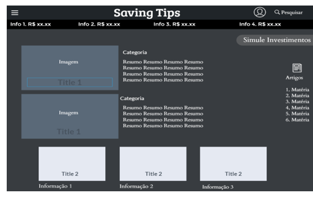 

A tela de Home-Page traz notícias da atualidade relacionado ao mundo da economia como, melhores títulos pré-fixados do momento, uma barra na parte superior com informações rápidas (variações de câmbio, dívida pública referente ao ano anterior, entre outros), um botão que redireciona para uma página devida onde o usuário poderá realizar simulações de investimentos, um botão para pesquisar assuntos específicos.

### Tela - Login
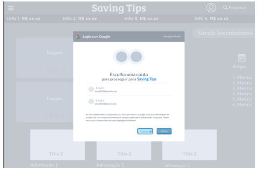

A tela de login permite o usuário vincular uma conta de seu Gmail já existente ao site para que ele possa salvar e rever suas notícias favoritas na frequência que desejar. Admitindo também a possibilidade de desfrutar de demais funcionalidades que podem ser inseridas no site de maneira personalizada pelo gosto usuário.

### Tela - Menu
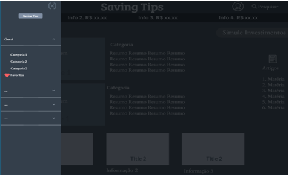

Ao clicar nos três traços indicados no canto superior esquerdo da tela, aparecerá uma barra lateral contendo o menu e suas funcionalidades.
-	Categorias, onde o usuário poderá encontrar notícias por tópicos específicos
-	Favoritos, onde o usuário poderá salvar suas notícias para ler depois 
-Dicionário de Termos, o usuário poderá pesquisar por palavras chaves ou termos específicos utilizados no mundo da economia. (ex: IPO, Selic, CDB e etc)

### Tela - Dicionário Termos
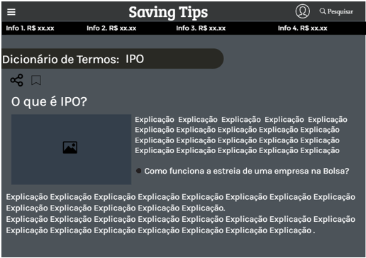

No dicionário de termos, o usuário poderá pesquisar por termos de economia que ele ouviu falar nos jornais, rádios, ou no dia a dia, como, “O que é IPO, FII, Taxa Selic entre outros.” Assim, ele poderá desenvolver melhor seu vocabulário e aprofundar seu conhecimento.

### Tela - Resultado de Pesquisa
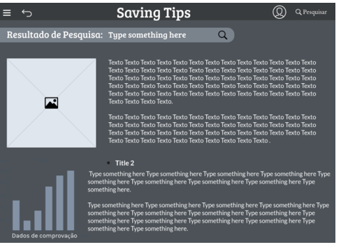

Assim que o usuário informa um tópico de pesquisa, ao clicar no botão Ok, ele é direcionado para uma tela que traz a relação de notícias associadas ao tópico informado. Este resultado é apresentado na Figura a seguir.

### Tela - Leitura Noticias

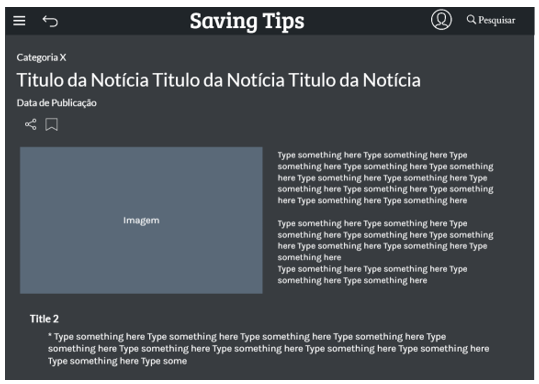

A tela de Leitura de Notícia apresenta uma notícia especifica que o usuário escolheu na Home-Page. Dois botões onde ele pode salvar e compartilhar essa mesma notícia. E um botão que ao clica-lo, o usuário retornara à Home-Page.

### Tela - Salvar Notícias Preferidas
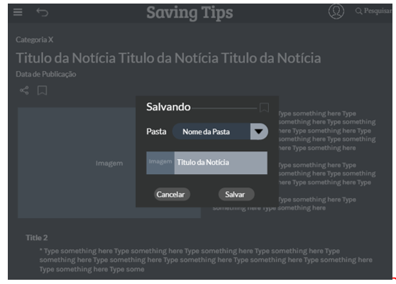

A tela que permite o salvamento de notícias preferidas é uma janela modal (surge sobre outras janelas) quando o usuário pressiona o ícone de bandeira na tela de Leitura de Notícia. Nesta tela, a notícia a ser salva é visualizada e o usuário pode informar uma pasta ou escolher entre as já cadastradas. Em seguida deve confirmar ou cancelar o salvamento. Na sequência, a tela é fechada voltando para o ambiente anterior onde o ícone de bandeira é apresentado agora de outra cor.

### Tela - Notícias Preferidas

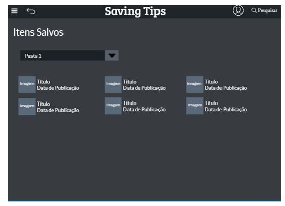
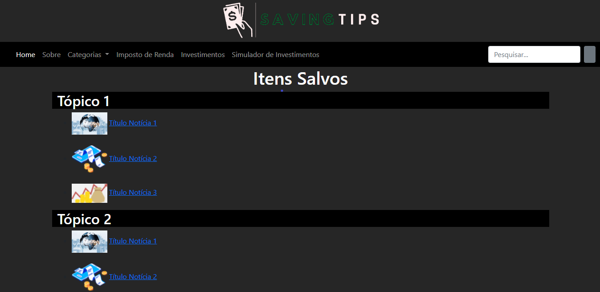

A tela de Notícias Preferidas apresenta a relação de notícias salvas pelo usuário. Nesta tela, as notícias são divididas em pastas informadas pelo usuário. Clicando na barra, o usuário pode selecionar de qual pasta ele quer visualizar as notícias salvas. Ao clicar em uma notícia é disparada a tela de visualização de notícia. 

### Tela - Simulador de Investimentos - Juliana
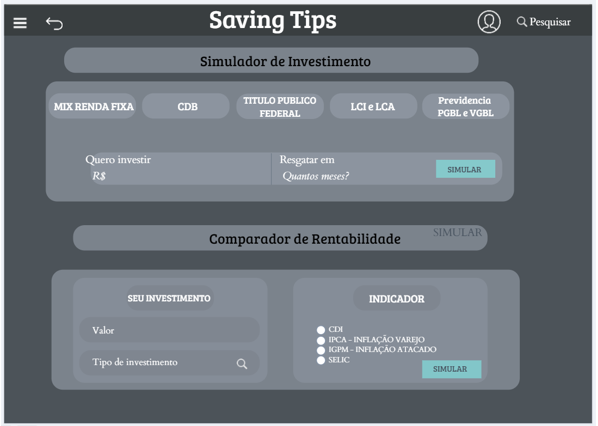

Na tela que permite ao usuário simule o investimento a realizar, deve-se informar o valor a se investir e o prazo para resgate. Em seguida, deve-se clicar em simular. Também permite que o usuário compre a rentabilidade, informando o valor investido e o tipo de investimento e, posteriormente marcando o indicador de comparação. Após clicar em simular o sistema irá plotar um gráfico comparativo.

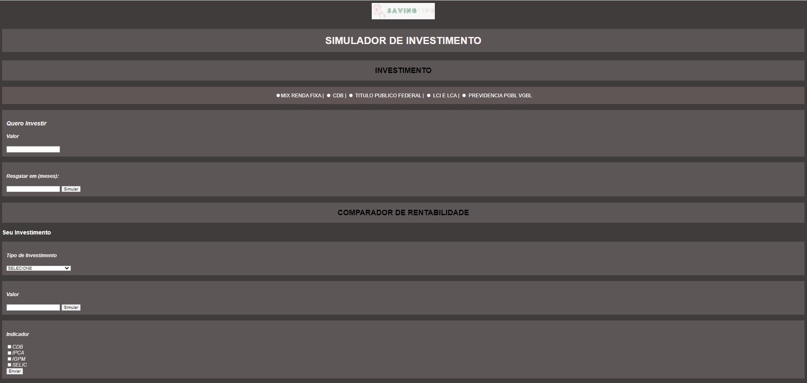

A página já se encontra em desenvolvimento, havendo necessidade de adequações de estética, padronização, organização da pagina, assim como, cabeçalho e rodapé.

